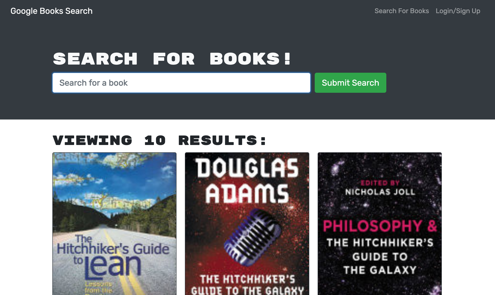

# <Google Books Search>

## Description

In creating this app, I was demonstrating my ability to utilize React by deploying an app with it. Also I needed to be familliar with utilizing all the resources Google gives me for free at my disposal.

To be fair, it didn't have to search for books, but I think the world needs a good TOME from time to time.

The big thing is that this project uses REACT, which a lot of people are not using to its full potential yet.

However, there was a HUGE complication I had with a node modules conflict that drove me to delete a lot of my files that conflicted.

## Table of Contents

- [Installation](#installation)
- [Usage](#usage)
- [Credits](#credits)
- [License](#license)

## Installation

This project is up and live at https://floating-forest-45449.herokuapp.com/

## Usage

Go to https://floating-forest-45449.herokuapp.com/

Search for a book in the search bar.
    
Press Search.

Enjoy seeing the results appear!

## Credits

Joseph Valancy https://github.com/Jvala2 joevalancy@gmail.com

## License

- [License](https://opensource.org/liscenses/MIT)
